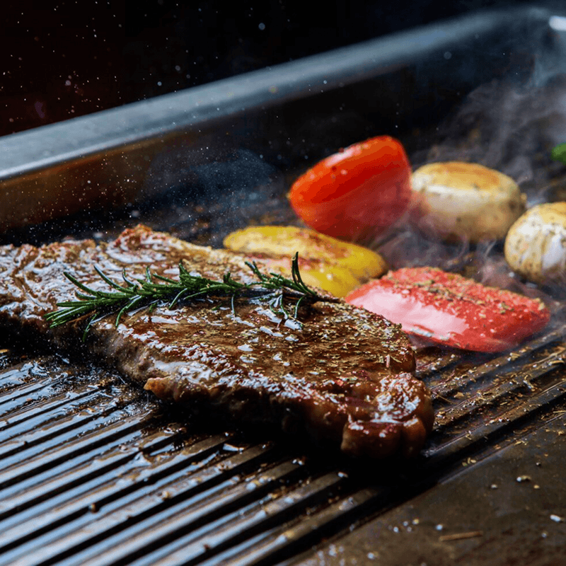

# Fire Bit — Steakhouse Landing Page

A responsive, bilingual (English / Arabic) landing page for **Fire Bit**, a premium steakhouse in Al-Arish, Egypt. Built with plain HTML, CSS, and JavaScript — no build step, no framework.

<!-- Add a screenshot: save it as docs/screenshot.png and uncomment the line below -->
<!--  -->

**Live demo:** _add your link here_ https://ahmedalahmedy.github.io/firebit_restaurant/

---

## Features

- **Bilingual with one click** — English and Arabic, with full RTL layout, Arabic fonts, and mirrored navigation. The choice is remembered, and first-time visitors with an Arabic browser see Arabic automatically.
- **Dark and light themes** — dark by default, with a warm sand light theme. The choice is remembered and applied before the page paints, so there is no flash.
- **Slide-in menu on every screen** — the hamburger menu works the same from phones to wide monitors. It closes with the X button, the Escape key, a click outside, or a click on any link.
- **Smooth scroll animations** — elements reveal as you scroll (ScrollReveal). Animations are skipped for visitors who prefer reduced motion.
- **Sections** — Home, About us, Menu, Events, Ingredients, Contact (map and info cards), Reservation, and Footer.
- **Contact tools** — embedded Google Map with a "Get directions" button, tap-to-call phone links, and WhatsApp booking.
- **Active link highlighting** — the navbar follows the section you are viewing.
- **Accessible by default** — labelled icon buttons, visible keyboard focus, meaningful `alt` text, and `rel="noopener noreferrer"` on external links.

## Tech stack

| Area | Tool |
| --- | --- |
| Markup | HTML5 |
| Styling | CSS3 (custom properties, grid, flexbox, logical properties, `backdrop-filter`) |
| Behavior | Vanilla JavaScript (ES6) |
| Animations | [ScrollReveal](https://scrollrevealjs.org/) 4.0.9 |
| Icons | [Remix Icon](https://remixicon.com/) 4.9.0 |
| Fonts | [Google Fonts](https://fonts.google.com/): Lora, Dancing Script, Tajawal, El Messiri, Aref Ruqaa |

ScrollReveal, Remix Icon, and the fonts load from a CDN, so the page needs an internet connection to look right.

## Project structure

```text
.
├── index.html
├── README.md
└── assets
    ├── css
    │   └── styles.css
    ├── js
    │   └── main.js
    └── img
        ├── favicon.png
        ├── home-*.png            hero pan and decorations
        ├── about-*.png           about section
        ├── menu-*.png            menu dishes and decorations
        ├── event-*.png           events section
        ├── ingredient-1…8.png    ingredients gallery
        └── reservation-img.png   reservation background
```

## Getting started

No installation is needed.

1. Download or clone the project.
2. Open `index.html` in your browser.

For a local server with live reload, use the **Live Server** extension in VS Code, or run:

```bash
npx serve .
```

## Customization

### Text and translations

English text lives directly in `index.html`. Arabic text lives in the `AR` object at the top of the language section in `assets/js/main.js`. Each translatable element connects the two with a `data-i18n` key:

```html
<h2 class="section__title" data-i18n="about.title">Our Story</h2>
```

```js
const AR = {
    'about.title': 'قصتنا',
    // ...
}
```

To translate an attribute such as `alt`, `title`, or `aria-label`, use `data-i18n-attr`:

```html

```

### Colors and theme

All colors are CSS variables in `assets/css/styles.css`. The dark theme values are in `:root` and the light theme values are in `[data-theme="light"]`.

| Variable | Purpose |
| --- | --- |
| `--first-color` | Main gold accent |
| `--body-color` | Page background |
| `--title-color` | Main text color |
| `--surface-color` | Background of the white About and Events boxes |
| `--btn-bg`, `--btn-seg`, `--btn-text` | Booking buttons |
| `--card-bg`, `--card-border` | Contact cards |

### Contact details

In the `#contact` and `#reservation` sections of `index.html`, update:

- **Phone numbers** — the `tel:` links (use the international format, for example `tel:+201000000000`).
- **WhatsApp** — the `phone=` value in the `api.whatsapp.com` link.
- **Social links** — the Facebook and Instagram `href` values.
- **Map** — replace the `src` of the `<iframe>` with the embed link from Google Maps (Share, then Embed a map).
- **Get directions** — replace the coordinates in the `contact__directions` link with your restaurant's location.

### Breakpoints

| Width | Change |
| --- | --- |
| `640px` and up | Contact cards switch to two columns |
| `1150px` and up | Full desktop layout for the page sections |
| `2048px` and up | Slightly larger base font size |

### Animations

Scroll animations are configured at the bottom of `assets/js/main.js` through `sr.reveal(...)` calls. Change the `delay`, `origin`, `distance`, or `duration` of any element there.

## Browser support

Works in current versions of Chrome, Edge, Firefox, and Safari. Features that depend on newer CSS (`backdrop-filter`, `color-mix`, logical properties) fall back to solid colors in older browsers.

## Deployment

Because the site is fully static, you can host it for free on any of these:

- **GitHub Pages** — push the project to a repository, then enable Pages under Settings.
- **Netlify** or **Vercel** — drag the project folder into the dashboard.

## Before you publish

- [ ] Replace the placeholder email `firebit@email.com` in the footer.
- [ ] Point "View on Facebook" in the Events section to the restaurant's page.
- [ ] Confirm the working hours in the footer.
- [ ] Confirm the Facebook and Instagram links point to the restaurant's accounts.
- [ ] Update the event date in the Events section.

## Credits

- Fonts from [Google Fonts](https://fonts.google.com/)
- Icons by [Remix Icon](https://remixicon.com/)
- Scroll animations by [ScrollReveal](https://scrollrevealjs.org/)

## License

All rights reserved © Ahmed Gomaa. Add a license file if you plan to open-source the project.
